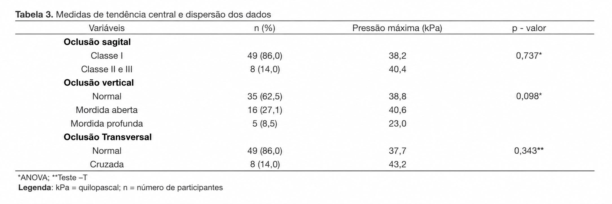
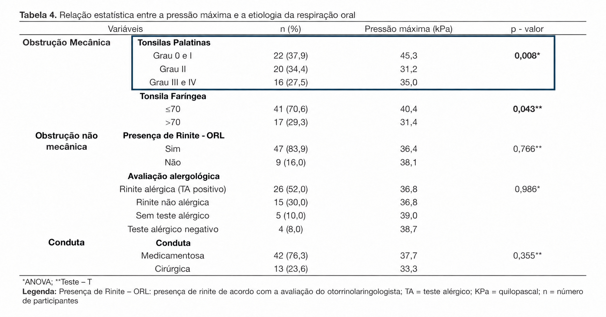
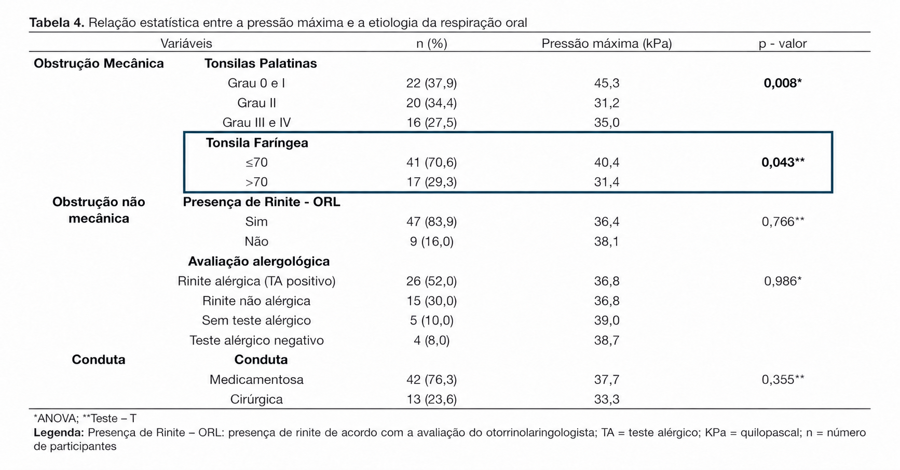

# Introdução: {.Transicao data-background-image="imagens/Transicao.png" data-background-size="cover"}

## Artigo e autores:

::: box-blue

**Relação entre a etiologia da respiração oral e a pressão máxima da língua**

<u>Autores:</u>

- Tiago Costa Pereira;

- Renata Maria Moreira Moraes Furlan;

- Andréa Rodrigues Motta.

:::

## Contextualização e Motivação:

::: box-blue
- A **respiração nasal** contribui para a proteção das vias aéreas e para o desenvolvimento adequado das estruturas da face e da boca.

- A **respiração oral** pode ser causada por obstruções mecânicas ou por condições como a rinite.

- **Crianças respiradoras orais** podem apresentar **alterações na fala, deglutição, oclusão dentária e posição da língua**.

- Apesar dessas alterações, ainda existiam poucos estudos relacionando a **causa da respiração oral à pressão máxima da língua**.
:::

## Objetivos:

::: box-blue

- **Objetivo geral:**

  - Analisar a relação entre a **etiologia da respiração oral** e a **pressão máxima da língua** em crianças.

 

**Pergunta de interesse:** a pressão máxima da língua está relacionada à causa e ao grau de obstrução da respiração oral?

:::

## Amostra:

::: box-blue
- **Amostra:** 59 crianças respiradoras orais; 

  - 20 meninas (33%);
  
  - 39 meninos (67%).
   
- **Idade:** entre 3 e 12 anos.

- **Local:** Ambulatório do Respirador Oral do Hospital das Clínicas da Universidade Federal de Minas Gerais (UFMG).

- **Coleta:**

  - Pressão máxima da língua medida com o aparelho IOPI;

  - Realização de três medições para cada participante;
  
  - Informações sobre a causa da respiração oral e a oclusão dentária coletadas nos prontuários.
:::

#  Metodologia estatística: {.Transicao data-background-image="imagens/Transicao.png" data-background-size="cover"}

## Variáveis analisadas:

::: box-blue 
- **Desfecho:** Pressão máxima da língua, medida em quilopascal (kPa).

- **Fatores de exposição:**

  - idade;
  - gênero;
  - hipertrofia das tonsilas palatinas;
  - hipertrofia da tonsila faríngea;
  - presença e tipo de rinite;
  - oclusão dentária;
  - tratamento medicamentoso ou cirúrgico.

::::

## Testes aplicados:

::: {.caixa-teste}

- **Teste t de Student:** comparação da pressão entre dois grupos.

$$
\begin{cases}
H_0:\mu_1=\mu_2\\
H_1:\mu_1\neq\mu_2
\end{cases}
$$

:::

::: {.caixa-teste .caixa-anova}

- **ANOVA (com pós-teste de Tukey):** comparação entre três ou mais grupos.

$$
\begin{cases}
H_0: \mu_1 = \mu_2 = \cdots = \mu_k \quad \text{(todas as médias iguais)}\\ 
H_1: \exists\, i,j \text{ tal que } \mu_i \neq \mu_j \quad \text{(pelo menos uma média difere)}
\end{cases}
$$

:::

::: {.caixa-decisao}

 - **Nível de significância:** $\alpha=0{,}05$ (5%).

 - **Decisão:** se $p<0{,}05$, rejeita-se $H_0$ → **há diferença estatisticamente significativa**.

:::

# Resultados:{data-background-image="imagens/transicao.png"}

## ANOVA e Teste-T — Oclusão Dentária

## ANOVA — Etiologia da Respiração Oral

## Teste-T — Etiologia da Respiração Oral

## Resultados

 

:::: {.columns .resultados-colunas}

::: {.column .tabela-estilo .small-table width="44%" style="padding-right: 25px; box-sizing: border-box;"}

| Variável | Teste | Valor de p |
|:---|:---:|:---:|
| Tonsilas palatinas | ANOVA | **0,008** |
| Tonsila faríngea | Teste t | **0,043** |

::: {.texto-desfecho}
**Variável desfecho:** pressão máxima da língua (kPa).
:::

:::

::: {.column width="56%" style="padding-left: 25px; box-sizing: border-box;"}

::: {.caixa-teste}

**Tonsilas palatinas — teste de Tukey**

- A diferença significativa ocorreu entre:

  - **Graus 0 e I:** 45,3 kPa;
  - **Grau II:** 31,2 kPa.

$p = 0{,}009$

:::

:::

::::

# Conclusão: {.transicao data-background-image="imagens/Transicao.png" data-background-size="cover"}

## Principais Achados:

::: box-blue

- As **obstruções mecânicas**, relacionadas às tonsilas palatinas e à tonsila faríngea, apresentaram relação com a **redução da pressão máxima da língua**.
  
- **Não foram encontradas diferenças significativas** na pressão máxima da língua em relação aos diferentes tipos de **oclusão dentária** analisados.

- A avaliação da pressão da língua pode ajudar a identificar possíveis alterações e orientar um **tratamento mais individualizado** para crianças respiradoras orais.

:::

## Importância do Teste de Associação:

::: box-blue

- Os testes **t de Student e ANOVA** permitiram verificar diferenças na **pressão máxima da língua** entre os grupos analisados.

- O **pós-teste de Tukey** identificou entre quais classificações das tonsilas palatinas ocorreu a **diferença estatisticamente significativa**.
:::

## Contribuição para a Sociedade:

::: box-blue

- O estudo contribui para compreender a relação entre a **respiração oral** e a **pressão da língua em crianças**.

- Os resultados reforçam a importância de:

  - identificar **precocemente possíveis alterações**;
  
  - apoiar a **avaliação multiprofissional**;
  
  - orientar o **acompanhamento e o tratamento das crianças**.

:::

# Obrigado. {.unnumbered .Transicao data-background-image="imagens/Transicao.png" data-background-size="cover"}