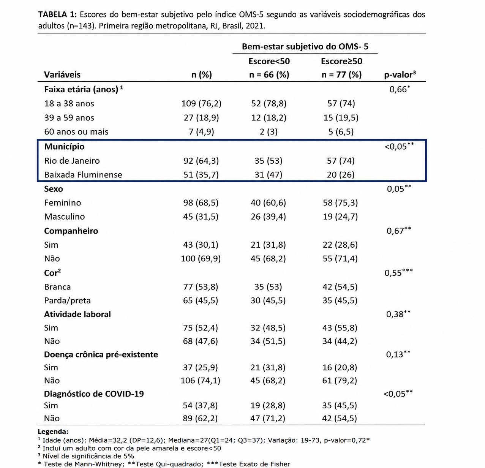
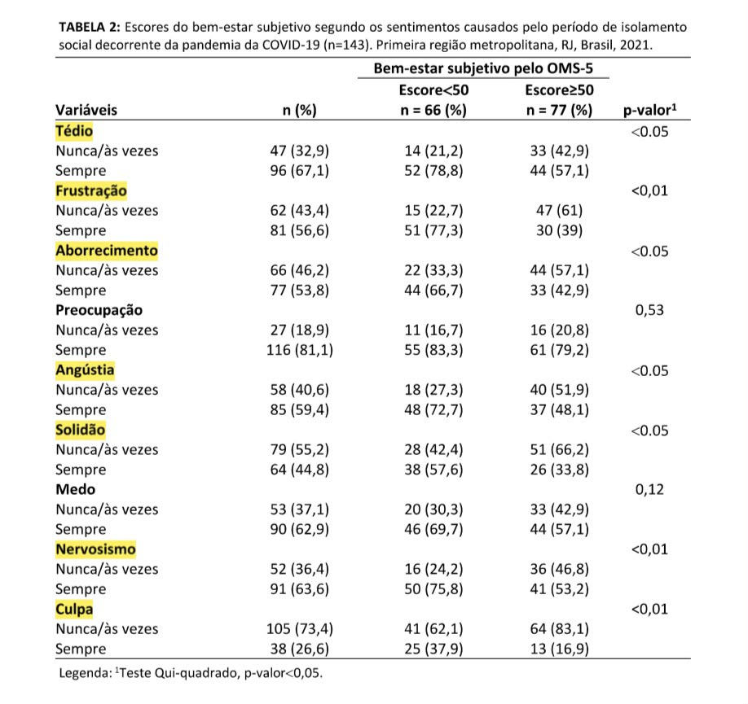

# Introdução:{.transicao data-background-image="imagens/transicao.png" data-background-size="cover"}

## Artigo e autores:

::: box-blue

**Bem-estar subjetivo de residentes da região metropolitana do Rio de Janeiro
durante a COVID-19**

<u>Autores:</u>

- Deise Breder dos Santos Batista;

- Adriana Lenho de Figueiredo Pereira;

- Alan de Souza Campello Junior;

- Claudia da Silva Teixeira de Santana;

- Juliana Amaral Prata;

- Claudia Silvia Rocha Oliveira.
:::

## Motivação:

::: box-blue
- A pandemia de COVID-19 trouxe consequências **sociais, econômicas e psicológicas**.

- O isolamento social esteve associado a experiências como: 
   - estresse; 
   - solidão; 
   - irritabilidade; 
   - medo; 
   - frustração;
   - tédio;
   - insegurança.

- Diante disso, tornou-se importante investigar os impactos da pandemia sobre o **bem-estar subjetivo da população**.

:::

## Contextualização:

::: box-blue
- O **Bem-Estar Subjetivo (BES)** representa a forma como os indivíduos avaliam e vivenciam seu próprio bem-estar.

- No estudo, o BES foi avaliado por meio do **Índice de Bem-Estar da OMS (OMS-5)**.

- O OMS-5 é composto por **cinco questões** relacionadas a aspectos positivos do bem-estar.

- O índice gera um escore de **0 a 100**, no qual valores maiores indicam maior nível de bem-estar.

:::

## Objetivos:

::: box-blue
- Objetivo geral:

  - Identificar o nível do bem-estar subjetivo e seus fatores associados em residentes na região metropolitana do Rio de Janeiro durante a pandemia da COVID-19.

**Pergunta de interesse:** quais características e fatores estão associados ao bem-estar subjetivo?
:::

## Coleta da amostra:

::: {.box-blue style="font-size: 0.9em;"}
- **Amostra:** 143 adultos

  - 98 mulheres (68,5%);
  
  - 45 homens  (31,5%). 

- **Local:** primeira região metropolitana do RJ (Município do Rio de Janeiro e Baixada Fluminense).

- **Período:** janeiro a maio de 2021.

- **Coleta:**

  - Questionário eletrônico autoadministrado;

  - Divulgação por **redes sociais e aplicativos de mensagens**.
  
 

:::

# Metodologia Estatística:{.transicao data-background-image="imagens/transicao.png" data-background-size="cover"}

## Variáveis analisadas:

::: box-blue 
- Desfecho: Bem-estar subjetivo do OMS-5 

:::{.tabela-esquerda}
 | Classificação | Escore |
|---|---:|
| BES prejudicado | < 50 |
| BES preservado | ≥ 50 |   
:::

- Fatores de exposição:

  - **Sociodemográficos:** idade, sexo, município, cor da pele, atividade laboral, doença crônica e diagnóstico de COVID-19.

  - **Sentimentos no isolamento:** tédio, frustração, angústia, solidão, medo, entre outros.

  - **Percepção de risco:** exposição à COVID-19 em diferentes locais e meios de transporte.
:::

## Testes Aplicados:

::: box-blue
- **Qui-quadrado de Pearson (\*\*):** associação entre variáveis categóricas;

- **Teste Exato de Fisher (\*\*):** utilizado quando havia **menos de 5 observações**;

- Hipóteses:
$$
\begin{cases}
H_0: \text{as variáveis são independentes.} \\
H_1: \text{as variáveis são dependentes.}
\end{cases}
$$

- Nível de significância: $\alpha = 0{,}05$ (5%).

- **Decisão:** \(p < 0,05\) → rejeita-se \(H0\) → **há associação significativa**.
:::

# Resultados:{data-background-image="imagens/transicao.png"}

## Tabela 1

## Tabela 1.2

## Tabela 2.1 {.scrollable}

## Resultados

::: {.tabela-estilo}

| Variáveis                        | Valor de p |
|----------------------------------|------------|
| Município                        |  < 0,05    |
| Diagnóstico de COVID-19          |  < 0,05    |
| Tédio                            |  < 0,05    |
| Frustração                       |  < 0,01    |
| Aborrecimento                    |  < 0,05    |
| Angustia                         |  < 0,05    |
| Solidão                          |  < 0,05    |
| Nervosismo                       |  < 0,01    |
| Culpa                            |  < 0,01    |

::: {.texto-pequeno .texto-centralizado}
**Variável principal:** Bem-estar subjetivo do OMS-5
:::

:::

# Conclusão:{.transicao data-background-image="imagens/transicao.png" data-background-size="cover"}

## Principais Achados:

::: box-blue

- O escore global médio de **BES foi 51,1**;
  
- Houve associação significativa entre o **BES** e:
  - Residência na **Baixada Fluminense**;
  - **Diagnóstico de COVID-19**;
  - Sentimentos negativos durante o isolamento, como **tédio, frustração, angústia, solidão e nervosismo**;
  - Percepção de risco de exposição à COVID-19 em **transporte alternativo**.

- Os resultados evidenciaram impactos da pandemia sobre o **bem-estar subjetivo** dos participantes.

:::

## Importância do Teste de Associação:

::: box-blue

- Os testes de Qui-quadrado e Exato de Fisher permitiram verificar a existência de associação entre o **BES e os fatores analisados**.

- Com os testes, foi possível identificar quais fatores apresentaram **associação estatisticamente significativa** com o bem-estar subjetivo.

:::

## Contribuição para a Sociedade:

::: box-blue

- O estudo contribui para compreender os **impactos psicossociais da pandemia** sobre o bem-estar da população.

- Os resultados reforçam a importância de:
  - promover a **saúde mental**;
  - prevenir **agravos psicológicos**;
  - desenvolver **estratégias de cuidado** voltadas à população.

:::

## Conclusão dos autores:

::: box-blue

"O estudo lança luz sobre as necessidades psicossociais que podem decorrer da pandemia em curso e das 
demandas emergentes de estratégias de cuidados voltadas à promoção da saúde e prevenção de agravos, como as 
respostas emocionais prejudicadas e as situações de violência aqui identificadas."

::: 

# Obrigado. {.unnumbered .transicao data-background-image="imagens/transicao.png" data-background-size="cover"}